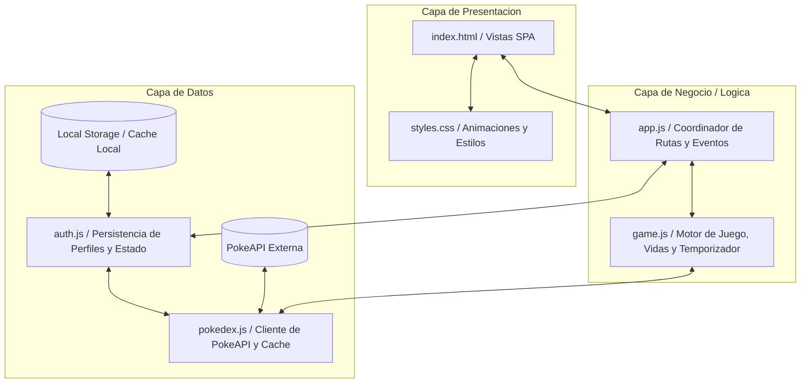

# Poke-Quest 🎮✨

**Poke-Quest** es una aplicación interactiva híbrida (Web y Móvil) inspirada en el clásico minijuego televisivo *"¿Quién es ese Pokémon?"*. El objetivo principal de la aplicación es desafiar los conocimientos del usuario para identificar Pokémon a partir de sus siluetas y permitirle completar su Pokédex digital de la primera generación.

El diseño se enfoca en ofrecer una experiencia de usuario premium, fluida, animada y totalmente adaptada a dispositivos móviles mediante el uso de tecnologías web vanilla empaquetadas con **Capacitor**.

---

## 🚀 Características Principales

*   **🎮 Modo de Juego Silhouette Quiz**: Adivina el Pokémon basándote únicamente en su silueta oscura. Si aciertas, se activa una animación de revelación y el Pokémon se añade de forma permanente a tu colección.
*   **❤️ Sistema Inteligente de Vidas**: 
    *   Comienzas con un máximo de 5 vidas.
    *   Fallas o saltos decrementan tu vida.
    *   Las vidas se recuperan de forma pasiva cada 4 horas con un temporizador en segundo plano o de forma activa completando un anuncio publicitario patrocinado bonificado (simulado o a través de Google AdMob).
*   **📖 Registro de Pokédex Interactivo**:
    *   Buscador rápido por nombre o número de ID nacional.
    *   Filtros inteligentes por estado de captura (*Atrapados*, *Pendientes*, *Todos*).
    *   Barra de progreso porcentual del avance de captura de los 151 Pokémon.
    *   Detalles ampliados al hacer clic: estadísticas base oficiales, tipos y diseño visual dinámico según el tipo elemental dominante.
*   **👤 Gestión de Usuarios y Estadísticas**:
    *   Acceso como **Invitado** (almacenamiento en dispositivo).
    *   Registro e inicio de sesión para guardar el progreso y la Pokédex.
    *   Métricas de rendimiento en tiempo real: precisión general, racha de aciertos actual, racha máxima, intentos totales y aciertos.

---

## 🛠️ Tecnologías Utilizadas

*   **Frontend Core**: HTML5 semántico y CSS3 Vanilla avanzado (con variables CSS HSL, animaciones de sacudida y brillo, transiciones SPA y diseño responsivo adaptativo).
*   **Lenguaje de Programación**: JavaScript ES6+ con modularización nativa por componentes.
*   **Integración de API**: [PokeAPI](https://pokeapi.co/) como fuente de datos estructurada para consumir información oficial de los Pokémon.
*   **Framework Híbrido**: [Capacitor JS](https://capacitorjs.com/) para compilar y ejecutar de forma nativa en plataformas móviles (Android / iOS) compartiendo el mismo código base.
*   **Monetización y Servicios Nativos**: Capacitor AdMob Plugin para la entrega de anuncios de recompensa (*rewarded video ads*), optimizando el espacio visual al omitir anuncios de tipo banner.
*   **Estilos y Tipografía**: Google Fonts (*Outfit* para lecturas modernas y *Press Start 2P* para elementos visuales de estética pixel art) y FontAwesome 6 para iconografía.

---

## 🏗️ Arquitectura de 3 Capas

La aplicación está estructurada siguiendo el patrón de diseño de **Arquitectura de Tres Capas** para garantizar el desacoplamiento de componentes, facilitar el mantenimiento y asegurar la escalabilidad del sistema:



1.  **Capa de Presentación (Presentation Layer)**:
    *   Encargada de la interfaz gráfica y la experiencia de usuario (UI/UX).
    *   *Componentes*: [index.html](file:///c:/Users/jorge/OneDrive/Escritorio/Proyectos/Poke-Quest/www/index.html) (estructura de pantallas SPA como Splash, Menú Principal, Juego, Pokédex y Modales de detalles/anuncios) y [styles.css](file:///c:/Users/jorge/OneDrive/Escritorio/Proyectos/Poke-Quest/www/styles.css) (diseño visual adaptativo, animaciones y esquemas de color por tipo de Pokémon).

2.  **Capa de Lógica de Negocio (Business Logic Layer - BLL)**:
    *   Contiene las reglas de negocio, control de flujo del juego y navegación de la SPA.
    *   *Componentes*: 
        *   [app.js](file:///c:/Users/jorge/OneDrive/Escritorio/Proyectos/Poke-Quest/www/src/js/app.js): Actúa como el coordinador central; gestiona el enrutamiento interno, responde a los eventos del usuario e interactúa con el resto de módulos.
        *   [game.js](file:///c:/Users/jorge/OneDrive/Escritorio/Proyectos/Poke-Quest/www/src/js/game.js): Controla el motor del juego, valida si la respuesta ingresada es correcta, calcula las rachas y gestiona el temporizador de recuperación de vidas.

3.  **Capa de Acceso a Datos (Data Access Layer - DAL)**:
    *   Se encarga de la comunicación con fuentes de datos externas e internas para leer, almacenar y procesar información persistente.
    *   *Componentes*:
        *   [pokedex.js](file:///c:/Users/jorge/OneDrive/Escritorio/Proyectos/Poke-Quest/www/src/js/pokedex.js): Se comunica con la API externa **PokeAPI**, procesa y da formato a los tipos y estadísticas base de los Pokémon, e implementa caché en memoria para optimizar peticiones repetidas.
        *   [auth.js](file:///c:/Users/jorge/OneDrive/Escritorio/Proyectos/Poke-Quest/www/src/js/auth.js): Gestiona el almacenamiento persistente de sesiones de usuario, registro/autenticación en local, y guardado del estado del juego (`gameState`) en el almacenamiento local del navegador (`localStorage`).

---

## 👥 Metodología de Desarrollo (Scrum)

El ciclo de vida del desarrollo de **Poke-Quest** se rigió bajo la metodología ágil **Scrum**, permitiendo entregas incrementales y un proceso iterativo de alta calidad:

*   **Roles en el Equipo**:
    *   *Product Owner*: Definió las historias de usuario del backlog, priorizando la fidelidad visual y el comportamiento del minijuego original.
    *   *Scrum Master*: Facilitó las ceremonias y eliminó impedimentos técnicos (tales como bloqueos CORS en la API y problemas de integración híbrida de Capacitor).
    *   *Development Team*: Encargado de codificar las capas de lógica, diseño CSS y comunicación con APIs externas.
*   **Artefactos Scrum**:
    *   **Product Backlog**: Lista priorizada de funcionalidades, desde la carga básica de Pokémon hasta el sistema de login y compilación móvil.
    *   **Sprint Backlog**: Tareas específicas acordadas al inicio de cada iteración.
*   **Planificación de Sprints (Ejemplo de Ejecución)**:
    *   **Sprint 1 (MVP de Juego)**: Implementación de la Capa de Presentación básica y consumo de la API de Pokémon para la silueta del juego.
    *   **Sprint 2 (Pokédex e Interfaces)**: Desarrollo del catálogo de Pokédex con buscador y filtros por estado de captura.
    *   **Sprint 3 (Persistencia de Datos)**: Desarrollo del módulo de autenticación local, sistema de vidas con regeneración periódica y estadísticas detalladas por perfil.
    *   **Sprint 4 (Compilación Híbrida y Lanzamiento)**: Sincronización mediante Capacitor, integración del SDK de AdMob y optimización visual (Brillo de tipos elementales y vibración de tarjeta).

---

## 📂 Estructura del Proyecto

```text
Poke-Quest/
├── android/                  # Archivos del proyecto nativo Android (Capacitor)
├── www/                      # Código fuente de la aplicación Web
│   ├── assets/               # Imágenes, logotipos y recursos multimedia
│   ├── src/
│   │   └── js/
│   │       ├── app.js        # Coordinador de lógica y eventos (Negocio)
│   │       ├── auth.js       # Autenticación y persistencia de perfiles (Datos)
│   │       ├── game.js       # Motor de juego, vidas y tiempos (Negocio)
│   │       └── pokedex.js    # Conexión externa a PokeAPI y caché (Datos)
│   ├── index.html            # Vistas y layouts SPA (Presentación)
│   └── styles.css            # Estilos del sistema de diseño (Presentación)
├── capacitor.config.json     # Configuración de Capacitor y AdMob
├── package.json              # Dependencias y scripts de desarrollo
└── README.md                 # Documentación del proyecto
```

---

## 💻 Configuración y Desarrollo Local

### Requisitos Previos
*   [Node.js](https://nodejs.org/) (Versión 18+ recomendada).

### Instalación
1.  Clona el repositorio e ingresa a la raíz:
    ```bash
    cd Poke-Quest
    ```
2.  Instala las dependencias del proyecto:
    ```bash
    npm install
    ```

### Ejecución
Para iniciar el servidor de desarrollo web:
```bash
npm start
```
*Abre tu navegador en `http://localhost:8000` (o la dirección provista por la consola).*

---

## 📱 Despliegue en Dispositivos Móviles (Capacitor)

1.  **Sincronizar el directorio web (`www`) con el código nativo:**
    ```bash
    npm run cap:sync
    ```
2.  **Abrir el entorno nativo en Android Studio:**
    ```bash
    npx cap open android
    ```
3.  Compila, ejecuta o genera la firma APK directamente desde Android Studio.

---

## 👑 Membresía Premium y Pagos con Mercado Pago

Poke-Quest cuenta con un sistema de membresía Premium opcional que otorga ventajas exclusivas:
*   **Vidas infinitas** (`∞/5`) para jugar sin interrupciones.
*   **Sin publicidad** al omitir anuncios o saltar Pokémon sin costo de vida.
*   **Insignia dorada** de corona en el perfil de usuario.

El sistema de cobro mensual ($2.000 CLP) está integrado con el SDK v2 oficial de **Mercado Pago**, estructurado en dos capas para garantizar la seguridad de tus credenciales:

### 1. Frontend (Tokenización de Tarjeta)
El cliente captura los datos de la tarjeta en un modal responsivo y los envía directamente a los servidores de Mercado Pago mediante su clave pública (configurada en `www/src/js/app.js`) para generar un token de tarjeta seguro (`card_tok_...`).

### 2. Backend (Procesamiento de Pago Seguro)
Para no exponer tu `Access Token` privado en la aplicación, el token de la tarjeta se envía a un servidor backend local en Node.js que realiza la solicitud de cargo real mediante la API de Pagos de Mercado Pago.

#### Configuración del Servidor de Pagos
1. Ve a la carpeta `server` e instala las dependencias:
   ```bash
   cd server
   npm install
   ```
2. Crea o edita el archivo `server/.env` e introduce tus credenciales de Mercado Pago:
   ```env
   MERCADOPAGO_ACCESS_TOKEN=TU_ACCESS_TOKEN_SECRETO
   PORT=3000
   ```
3. Inicia el servidor de pagos:
   ```bash
   npm start
   ```

#### Requisito de Seguridad SSL (HTTPS)
El SDK oficial de Mercado Pago exige que la aplicación funcione bajo una conexión segura (HTTPS) para el uso de credenciales de producción (`APP_USR-...`).
*   **Navegador**: Ejecuta el servidor local con soporte HTTPS (ya configurado en `npm run dev`) y accede a través de `https://localhost:8000`.
*   **Móvil (Capacitor)**: Ya se configuró el esquema seguro (`"androidScheme": "https"`) en `capacitor.config.json` para emular un origen seguro nativo en Android.
*   **Prueba Local Sin SSL**: Si deseas probar localmente sobre `http://`, reemplaza tus claves por credenciales de prueba (**Modo Sandbox** que inician con `TEST-`), las cuales no exigen certificados SSL.